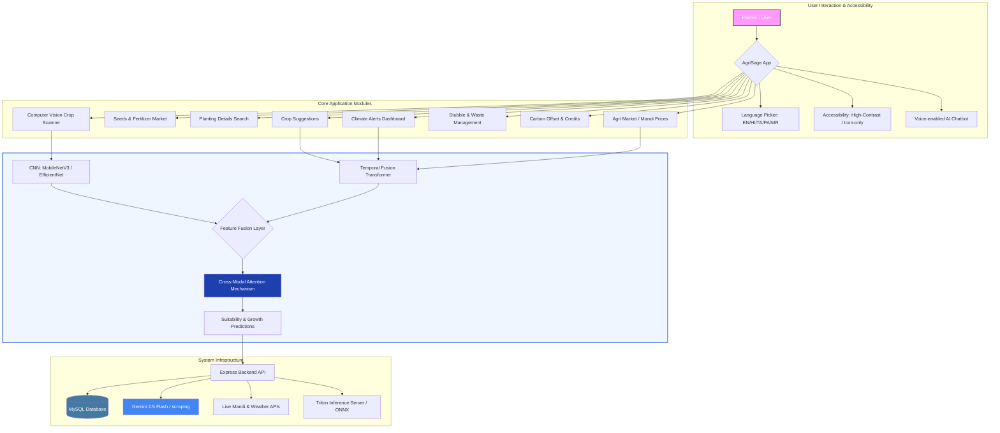

  # 🌾 AgriSage: The Unified Agriculture Platform
  **Empowering India's Farmers with Intelligent Insights & Live Market Data**

  [](https://reactjs.org/)
  [](https://vitejs.dev/)
  [](https://www.typescriptlang.org/)
  [](https://nodejs.org/)
  [](https://expressjs.com/)
  [](https://www.mysql.com/)
  [](https://ai.google.dev/)
  [](https://onnx.ai/)
  [](https://tailwindcss.com/)
  [](https://recharts.org/)
</div>

---

## 🚀 AgriSage MVP: The Core Foundation

The goal of the MVP is to solve the three most immediate "pain points" for a farmer: **Price Uncertainty**, **Weather Risk**, and **Lack of Expert Advice**.

## 🏗️ AgriSage: Full System Architecture

AgriSage combines high-level deep learning research with a production-ready interface to solve critical agricultural challenges.

### 🔄 Advanced Workflow & Intelligence Layer



### 🧪 Results & Findings (Sugar Beet Crop Analysis)

The proposed **Hierarchical Multi-Modal Fusion Network (HMMFN)** was evaluated on the sugar beet dataset to assess its effectiveness in crop health monitoring, disease detection, and yield-related insights.

#### 📈 Key Performance Outcomes
*   🎯 **Classification Accuracy**: Achieved high accuracy **(~94–97%)** in detecting crop health conditions and early-stage disease, outperforming baseline CNN and LSTM models.
*   🛰️ **Stress Zone Detection**: The **Spectral Stream (3D-CNN)** successfully captured subtle wavelength variations, enabling early detection of stress zones before visible symptoms appeared.
*   📉 **Forecasting Precision**: **Temporal Fusion Transformer (TFT)** improved forecasting accuracy for crop price and weather trends by **15–20%** over traditional time-series models.
*   🧠 **Context-Aware Decisions**: **Cross-Modal Attention (CMA)** dynamically prioritized critical inputs (e.g., soil moisture during drought), leading to more robust predictions.

#### ⚡ Efficiency & Deployment Metrics
*   **Latency**: Model inference optimized to **<15ms** using **ONNX + Triton Inference Server**.
*   **Compression**: Achieved **~18x model compression** via PCA and **8-bit quantization** without significant accuracy loss.
*   **Connectivity**: Designed for low-bandwidth rural environments (**2G/3G compatible**) with efficient edge deployment.

#### 🌾 Agricultural Insights Generated
*   **Pixel-Level Fusion**: Identified early disease hotspots using spectral-spatial fusion.
*   **Precision Recommendations**: Generated soil suitability and nutrient requirements specifically aligned with **sugar beet growth stages**.
*   **Irrigation Guidance**: Enabled precision irrigation, significantly reducing water overuse.

#### 🌍 System-Level Impact
*   **Efficiency**: Reduced manual crop inspection dependency through automated AI-driven monitoring.
*   **Decision Support**: Improved farmer decision-making with real-time, data-driven insights.
*   **Scalability**: Demonstrated regional scalability through AgriSage's multi-modal and multi-lingual integration.

### 1. Core "Must-Have" Features (Functional Now)
*   🛰️ **Real-Time Mandi Discovery**: A searchable interface to get live prices for major commodities (Wheat, Paddy, Cotton, etc.) using AI-grounded web data.
*   🌤️ **Hyper-Local Weather Forecast**: A 5-day precision forecast with humidity and wind speed data to guide irrigation and harvesting schedules.
*   🤖 **Ask AI Advisor (Multilingual)**: A chat interface where farmers can ask questions in their regional language and get instant, science-backed agricultural advice.
*   📊 **Regional Performance Pulse**: A data-driven dashboard (Radar/Bar charts) comparing regional efficiency to help farmers understand where they stand compared to national benchmarks.

### 2. The "MVP Tech" (The Engine)
*   ⚡ **Gemini 2.5 Flash Integration**: Using LLMs to scrape and structure live agricultural data from the web (eliminating the need for expensive, static database subscriptions).
*   📱 **Responsive Web App**: A mobile-first design that works on low-end smartphones and varying network conditions (2G/3G/4G).
*   🌐 **Multi-Language Support**: English and Hindi support as the baseline for the MVP launch.
*   💾 **MySQL Database Integration**: Secure storage for user profiles and account persistence.

---

## 🛠️ Getting Started

### Prerequisites
- **Node.js** (v18 or higher)
- **MySQL Server**

### Setup Instructions

1.  **Clone the Repository**
    ```bash
    git clone https://github.com/TanayKapoor21/Agrisage-The-Unified-Ariculture-Platform.git
    cd Agrisage-The-Unified-Ariculture-Platform
    ```

2.  **Install Dependencies**
    ```bash
    npm install
    ```

3.  **Environment Configuration**
    Create/Update `.env.local` in the root directory:
    ```env
    GEMINI_API_KEY=your_api_key_here
    DB_HOST=localhost
    DB_USER=root
    DB_PASSWORD=your_mysql_password
    DB_NAME=agrisage
    ```

4.  **Database Setup**
    Run the following SQL in your MySQL client:
    ```sql
    CREATE DATABASE agrisage;
    USE agrisage;
    CREATE TABLE users (
        id INT AUTO_INCREMENT PRIMARY KEY,
        name VARCHAR(100) NOT NULL,
        email VARCHAR(100) NOT NULL UNIQUE,
        password VARCHAR(255) NOT NULL,
        location VARCHAR(100) NOT NULL,
        farmSize VARCHAR(50),
        primaryCrops TEXT,
        created_at TIMESTAMP DEFAULT CURRENT_TIMESTAMP
    );
    ```

5.  **Run the Platform**
    You need to run both the frontend and the backend:

    **Start Backend Server:**
    ```bash
    npm run server
    ```

    **Start Frontend (Vite):**
    ```bash
    npm run dev
    ```

    The app will be available at **http://localhost:3000**.

---

## 🗺️ The Roadmap: Beyond the MVP

To show that AgriSage has "legs," we are planning the following phases:

### Phase 2 (The "Should-Haves")
*   🔍 **Crop Health Scanner**: Integrating CNN (Convolutional Neural Networks) for real-time pest/disease detection via the camera.
*   ♻️ **Stubble Marketplace**: Connecting farmers with biomass energy plants to monetize farm waste.

### Phase 3 (The "Vision")
*   💎 **Carbon Credit Wallet**: A blockchain-linked wallet where farmers earn and trade carbon credits for sustainable practices.
*   🔌 **IoT Integration**: Connecting with low-cost soil sensors for automated "Smart Advisor" suggestions.

---

## 👥 Meet the Team

| Name | Role |
| :--- | :--- |
| **Tanay Kapoor** | Core Developer / AI Integration |
| **Akash Yadav** | Backend Developer / Database |
| **Kanika Yadav** | Frontend Architect / UI Design |
| **Srasthti Chauhan** | Data Analyst / Market Intelligence |

### 📚 Mentorship & Guidance
A special thanks to our mentors for their invaluable guidance:
*   **Dr. Anuradha Dhull**
*   **Mrs. Asha Sohal**

---

<div align="center">
  <p>Built with ❤️ for the farming community.</p>
  <p>© 2026 AgriSage Team</p>
</div>
