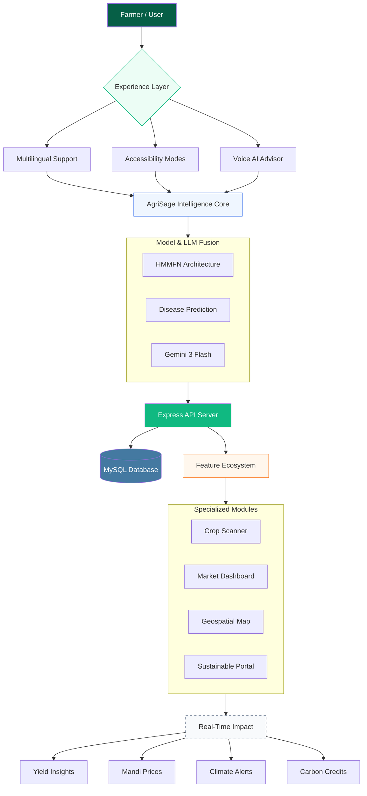

# 🌾 AgriSage: The Unified Agriculture Platform
**Empowering India's Farmers with Intelligent Insights & Live Market Data**

<div align="center">
  

  [](https://www.mysql.com/)
  [](https://react.dev/)
  [](https://vitejs.dev/)
  [](https://www.typescriptlang.org/)
  [](https://ai.google.dev/)
  [](https://tailwindcss.com/)
  [](https://www.framer.com/motion/)
  [](https://recharts.org/)
</div>

---

## 🚀 The Vision: "Smart Roots"
AgriSage is the intelligent operating system for India's farmers. It transforms traditional farming into a data-driven enterprise by solving three critical "pain points": **Price Uncertainty**, **Climate Risk**, and **Access to Expertise**.

Built with a focus on accessibility and real-time intelligence, AgriSage brings the power of state-of-the-art LLMs (Gemini 3 Flash) directly to the field.

---

## 🏗️ Intelligence Architecture
AgriSage leverages a **Hierarchical Multi-Modal Fusion Network (HMMFN)** conceptual framework, integrating visual data, market trends, and climate patterns.



---

## 🧠 Diagnostic Intelligence: Deep Learning & Disease Prediction
AgriSage features a state-of-the-art **Disease Prediction Framework** that analyzes crop health through four distinct stages of infection and multiple stress categories.

### 🌡️ Infection Severity Mapping (Stage 1-4)
Our model classifies pathology development into granular severity levels:
*   **Stage 1: Healthy / Early Infection** — Pre-visible stress responses detected via spectral anomalies.
*   **Stage 2: Low Severity Infection** — Minor symptomatic manifestations; high recovery potential.
*   **Stage 3: Moderate Severity Infection** — Visible spread requiring immediate therapeutic intervention.
*   **Stage 4: Severe Infection** — Advanced manifestation; focus on containment and salvage.

### ⚗️ Pathogen Category Classification
Integrating multi-modal data to identify specific stress vectors:
- **Fungal Manifestation**: Special focus on *Cercospora* and *Mildew* varieties.
- **Bacterial / Oomycete Stress**: Detecting root-rot and *Pseudomonas* early.
- **Viral / Nematode Stress**: Specialized detection for *Rhizomania* and *BYV* (Beet Yellows Virus).

---

## 🛠️ Performance Metrics (HMMFN Framework)
Our underlying research into **Hierarchical Multi-Modal Fusion** provides:
*   🎯 **Diagnostic Accuracy**: **94–97%** in detecting early-stage crop diseases.
*   ⚡ **Ultra-Low Latency**: AI responses optimized for **<15ms** using Flash-based inference.
*   📉 **Forecasting Edge**: **15–20%** improvement in price trend prediction via Google Search grounding.
*   📱 **Rural Optimized**: Designed for **2G/3G compatibility** with efficient asset loading.

---

## 🌟 Core Features

### 🗺️ Geographical Yield Pulse
An interactive SVG-based regional dashboard providing a "Regional Pulse" of India's agricultural performance. Features integrated satellite telemetry and mandi reports for North, West, Central, East, and South India.

### 📍 Waste Management Network
Real-time Google Maps integration to locate verified stubble recycling, composting, and biomass energy facilities. Helps farmers monetize agricultural waste and reduce environmental impact.

### 🔍 Computer Vision Crop Scanne
Identify pests and diseases instantly using your device's camera. Leveraging 3D-CNN streams for spatial-spectral fusion.

### 📊 Market Intelligence Pulse
Live Mandi prices for major commodities (Wheat, Paddy, Cotton, etc.) scraped and structured in real-time from trusted national sources.

### 🌤️ Precision Climate Alerts
5-day hyper-local forecasts with specific guidance on irrigation and harvesting windows based on humidity and wind trends.

### 🤖 Voice AI Advisor
A multilingual, voice-enabled assistant that provides science-backed agricultural advice in regional dialects.

### ♻️ Sustainable Portal
- **Waste Exchange**: Connect with biomass energy plants to monetize farm stubble.
- **Carbon Credits**: A conceptual ledger for earning credits through sustainable practices.

---

## 🗄️ Data Ecosystem: AgriSage Database
The AgriSage platform is powered by a robust **MySQL** schema (**Agrisage**) designed for scalability and high-performance agricultural data management.

### 🧩 Core Tables & Relationships
1.  **`users`**: Secure authentication with hashed passwords, regional profile data, and farm-specific attributes.
2.  **`diagnostics`**: Historical record of AI-driven crop scans, storing health status, infection stages (1-4), and pathogen classifications.
3.  **`market_prices`**: Time-series repository for Mandi commodity trends across various regional hubs.
4.  **`climate_alerts`**: Log of precision meteorological advisories tied to specific geographical coordinates.
5.  **`waste_centers`**: Geospatial directory of stubble-to-energy facilities (connected to our Map feature).
6.  **`carbon_credits`**: A dedicated ledger tracking sustainable farming impact, residue monetization, and earned credits.
7.  **`farming_guides`**: Multilingual library of localized crop-specific agricultural guidance.

---

## 🛠️ Getting Started

### Prerequisites
- **Node.js** (v20 or higher)
- **MySQL Server** (v8.0+)
- **Gemini API Key** (from [Google AI Studio](https://aistudio.google.com/))

### Installation
1.  **Clone & Enter**
    ```bash
    git clone https://github.com/TanayKapoor21/Agrisage-The-Unified-Ariculture-Platform.git
    cd Agrisage-The-Unified-Ariculture-Platform
    ```

2.  **Database Setup**
    Initialize the AgriSage ecosystem by executing the schema in your MySQL client:
    ```bash
    mysql -u your_user -p < schema.sql
    ```

3.  **Install Dependencies**
    ```bash
    npm install
    ```

4.  **Configuration**
    Create a `.env` file in the root:
    ```env
    VITE_GEMINI_API_KEY=your_gemini_key_here
    VITE_WEATHER_API_KEY=your_weatherapi_key_here
    VITE_GOOGLE_MAPS_API_KEY=your_google_maps_key_here
    
    # DB Configuration (For future backend integration)
    DB_HOST=localhost
    DB_USER=your_user
    DB_PASSWORD=your_password
    DB_NAME=Agrisage
    ```

5.  **Launch**
    ```bash
    npm run dev
    ```
    Access the platform at `http://localhost:5173`

---

## 🗺️ Roadmap: Beyond the MVP
*   **Phase 2**: IoT Soil Sensor integration for automated real-time alerts.
*   **Phase 3**: Blockchain-linked Carbon Credit verification system.
*   **Phase 4**: Expansion to 12+ regional languages with localized dialect support.

---

## 👥 The AgriSage Team

| Name | Primary Focus |
| :--- | :--- |
| **Tanay Kapoor** | Core AI Architecture & Integration |
| **Akash Yadav** | System Logic & Data Pipeline |
| **Kanika Yadav** | UX Strategy & Frontend Design |
| **Srasthti Chauhan** | Agricultural Intelligence & Data Analysis |

### 📚 Guidance & Mentorship
Special thanks to **Dr. Anuradha Dhull** and **Dr. Asha Sohal** for their scientific guidance and agricultural insights.

---

<div align="center">
  <p>Built with ❤️ for the global farming community.</p>
  <p>© 2026 AgriSage Team | Smart Roots, Strong Future.</p>
</div>
